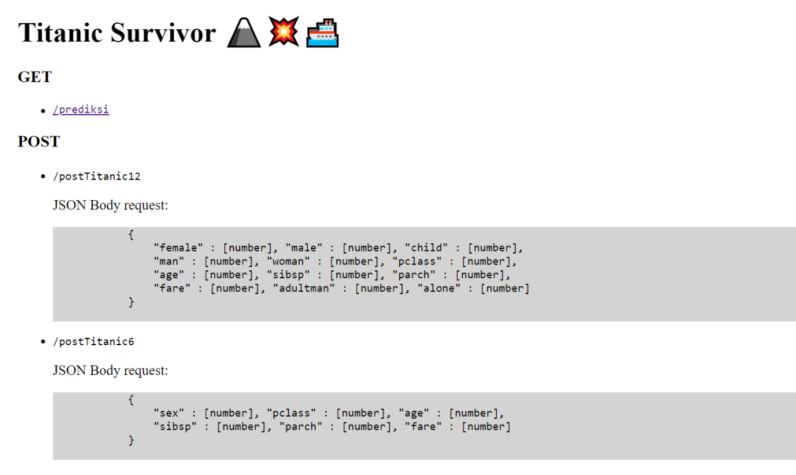
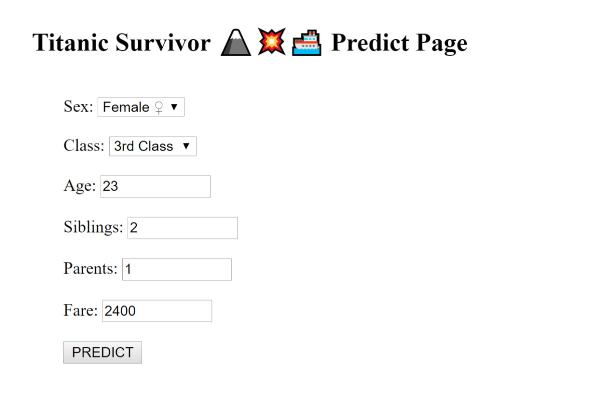
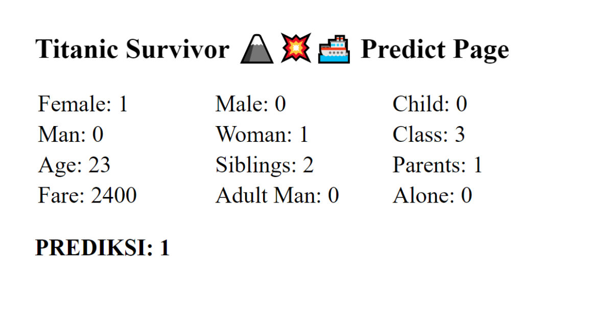

# Titanic Survivor 🗻💥🚢

## A simple Flask app & ML Sklearn to predict Titanic survivor.

1. Download/clone this repo, open and simply run it:

    ```bash
    $ git clone https://github.com/LintangWisesa/Flask_MLsklearn_TitanicSurvivor.git
    
    $ cd Flask_MLsklearn_TitanicSurvivor

    $ py flaskApp.py
    ```

2. It will automatically run on __http://localhost:1234/__. Open it via your favourite browser then you will see its landing page:

    

    Try to POST to __http://localhost:1234/postTitanic12__

    ```bash
    POST    /postTitanic12
    
    JSON Body request: 
        {
            "female" : [number], "male" : [number], "child" : [number],
            "man" : [number], "woman" : [number], "pclass" : [number],
            "age" : [number], "sibsp" : [number], "parch" : [number],
            "fare" : [number], "adultman" : [number], "alone" : [number]
        }
    ```

    Try to POST to __http://localhost:1234/postTitanic6__

    ```bash
    POST    /postTitanic6
    
    JSON Body request: 
        {
            "sex" : [number], "pclass" : [number], "age" : [number], 
            "sibsp" : [number], "parch" : [number], "fare" : [number]
        }
    ```

3. Go to GET __http://localhost:1234/prediksi__ then you will be redirected to its prediction page, where you can try to predict a profile. Insert __sex__, __class__, __age__, __siblings__, __parents__ & __fare__ then click "Predict" button.

    

    The result will be shown on __http://localhost:1234/prediksi__:

    

4. __Done!__ 👍 Enjoy your code 😎

#

#### Lintang Wisesa :love_letter: _lintangwisesa@ymail.com_

[Facebook](https://www.facebook.com/lintangbagus) | 
[Twitter](https://twitter.com/Lintang_Wisesa) |
[Google+](https://plus.google.com/u/0/+LintangWisesa1) |
[Youtube](https://www.youtube.com/user/lintangbagus) | 
:octocat: [GitHub](https://github.com/LintangWisesa) |
[Hackster](https://www.hackster.io/lintangwisesa)